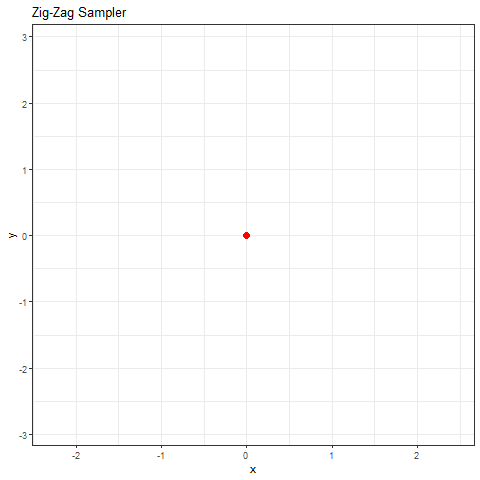
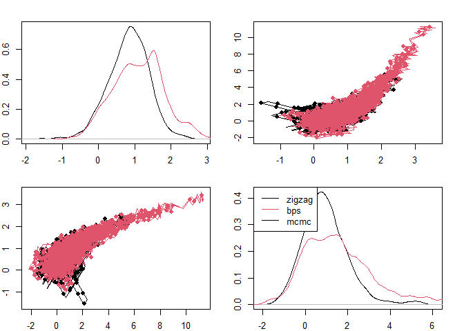

Concave-convex PDMP
================

## Description

PDMP-based samplers move a particle with a state and velocity using
deterministic dynamics. At random event times the velocity is updated
and the particle continues. The trajectories returned by the sampler
define a Markov process sampling the distribution of interest.



For more information see Joris Bierken’s
[Overview](https://diamweb.ewi.tudelft.nl/~joris/pdmps.html) and the
great Julia package
[ZigZagBoomerang](https://github.com/mschauer/ZigZagBoomerang.jl).

This package implements the concave-convex PDMP algorithm to facilitate
sampling from distributions of interest (particularly Bayesian
distributions).

## Install instructions

To install run the following:

``` r
library(devtools)
install_github("matt-sutton/ccpdmp")
```

The package documentation is still under development. A quick-start is
given below for using the package for approximate simulation. Exact
simulation requires more technical results either bounding directional
gradients of the log target or explicit concave-convex decomposition.

You can find documentation on the following:

1.  [Simulating a Poisson process using concave-convex
    thinning](simulating_poisson_process.md)
2.  [Exact simulation examples](exact_thinning.md)

## Quickstart

A PDMP moves a particle with a current state
(*x*<sub>*t*</sub>,*v*<sub>*t*</sub>) composed of a position
*x*<sub>*t*</sub> and velocity *v*<sub>*t*</sub> in some direction until
an event occurs which changes the velocity. The event rate for a
PDMP-based sampler is *λ*(*t*) = max (0,*f*(*t*)) where

*f*(*t*) =  − *v*<sub>*t*</sub>∂log *π*(*x*<sub>*t*</sub>)

If *f*(*t*) is a polynomial in *t*, or if there is a polynomial *g*(*t*)
such that *f*(*t*) ≤ *g*(*t*), then the package allows efficient exact
simulation with an automatic decomposition of the rate.

## Basic Example (Banana)

Consider the Banana distribution,

*π*(*x*<sub>1</sub>,*x*<sub>2</sub>) ∝ exp (−(*x*<sub>1</sub>−1)<sup>2</sup>+*κ*(*x*<sub>2</sub>−*x*<sub>1</sub><sup>2</sup>)<sup>2</sup>)

Taking the partial derivatives of the potential (negative log *π*) gives
the function below:

``` r
library(ccpdmp)
kappa <- 1 ## Arbitrary choice

dnlogpi <- function(x, index){
  x1 <- x[1]; x2 <- x[2]
  grad <- c(2*(x1-1) + 4*kappa*(x1^2-x2)*x1,  ## partial x_1
            2*kappa*(x2-x1^2))                ## partial x_2
  return(grad[index])
}
```

The partials are both polynomials in terms of *x*<sub>1</sub> and
*x*<sub>2</sub> where ∂<sub>1</sub>log *π*(*x*) is a polynomial of order
3 and ∂<sub>2</sub>log *π*(*x*) is a polynomial of order 2. Rather than
finding these terms exactly the ccpdmp package can evaluate these
polynomials via interpolation. The user just needs to specify a maximum
polynomial order. This allows exact simulation using either the BPS or
ZigZag:

``` r
z <- zigzag(1e3, dnlogpi, x0 = c(0,0), poly_order = 3) 
b <- bps(1e3, dnlogpi, x0 = c(0,0), poly_order = 3) 
plot_pdmp_multiple(list(zigzag=z, bps=b), nsamples = 1e3)
```

<!-- -->

## Approximate simulation

The ccpdmp package can simulate from event rates where *f*(*t*) is
polynomial. An approximate version of the sampler can be implemented
where the function *f*(*t*) is interpolated using evaluations over some
period of time \[0, *τ*<sub>max</sub>). The interpolation will not
necissarily upper-bound the true function so this method is approximate
not exact. An additional constant (add_interp) can be added to the
interpolating function to attempt to correct for the interpolation. See
below for an example that uses Stan to return derivatives in the
evaluation of
*f*(*t*) =  − *v*<sub>*t*</sub>∂log *π*(*x*<sub>*t*</sub>).

``` r
library(rstan)
```

    ## Warning: package 'rstan' was built under R version 4.0.5

    ## Loading required package: StanHeaders

    ## Warning: package 'StanHeaders' was built under R version 4.0.5

    ## Loading required package: ggplot2

    ## Warning: package 'ggplot2' was built under R version 4.0.5

    ## rstan (Version 2.21.2, GitRev: 2e1f913d3ca3)

    ## For execution on a local, multicore CPU with excess RAM we recommend calling
    ## options(mc.cores = parallel::detectCores()).
    ## To avoid recompilation of unchanged Stan programs, we recommend calling
    ## rstan_options(auto_write = TRUE)

    ## Do not specify '-march=native' in 'LOCAL_CPPFLAGS' or a Makevars file

``` r
stanmodelcode <- "
data {
  int<lower = 0> N;
  vector[N] x;
  int y[N];
}
parameters {
  real alpha;
  real beta;
}
model {
  alpha ~ normal(0, 2);
  beta ~ normal(0, 2);
  y ~ bernoulli_logit(alpha + x * beta);
}
"
x <- rnorm(20);  inv_logit <- function(u) 1 / (1 + exp(-u))
dat <- list(N = 20, 
            y = rbinom(20, 1, inv_logit(1 + 2 * as.vector(x))), 
            x=x); 
stan_fit <- stan(model_code = stanmodelcode,
            warmup = 0, data = dat, iter = 1, chains = 1, 
            verbose = FALSE) 
```

    ## 
    ## SAMPLING FOR MODEL '63256f475b2ed8664766ede5c2a9a479' NOW (CHAIN 1).
    ## Chain 1: 
    ## Chain 1: Gradient evaluation took 0.001 seconds
    ## Chain 1: 1000 transitions using 10 leapfrog steps per transition would take 10 seconds.
    ## Chain 1: Adjust your expectations accordingly!
    ## Chain 1: 
    ## Chain 1: 
    ## Chain 1: WARNING: No variance estimation is
    ## Chain 1:          performed for num_warmup < 20
    ## Chain 1: 
    ## Chain 1: Iteration: 1 / 1 [100%]  (Sampling)
    ## Chain 1: 
    ## Chain 1:  Elapsed Time: 0 seconds (Warm-up)
    ## Chain 1:                0 seconds (Sampling)
    ## Chain 1:                0 seconds (Total)
    ## Chain 1:

``` r
## return the gradient of the negative log posterior
dnlogpi <- function(x, partial){
  grad <- -1 * grad_log_prob(stan_fit, x) 
  return(grad[partial])
}

system.time(z <- zigzag(1e3, dnlogpi, return_rates = return_rates_zigzag,
                        x0 = c(1,2), poly_order = 4, tau_max = 1, add_interp = .1)) 
```

    ##    user  system elapsed 
    ##    0.33    0.03    0.36
