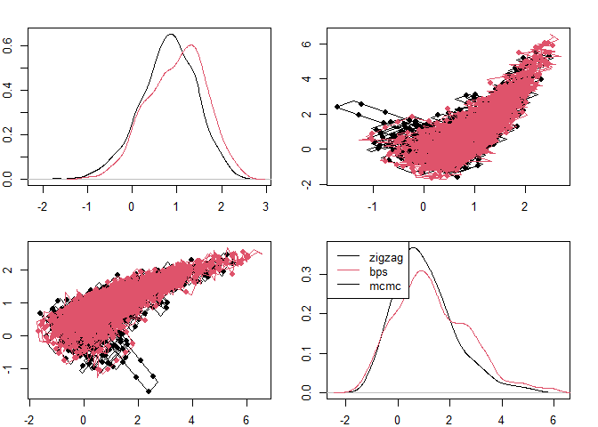
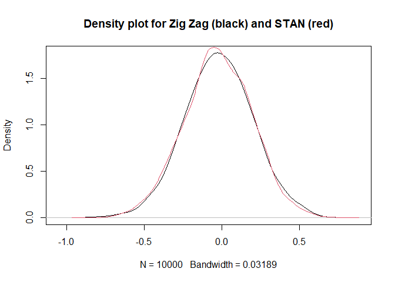

Concave-convex PDMP
================

## Description

This package implements the concave-convex PDMP algorithm to facilitate
sampling from distributions of interest (particularly Bayesian
distributions). I’ve put together some basic introduction below and
there are additional examples in the experiments folder. I’d recommend
you go through the steps below before diving into the experiments - I
haven’t written them up very well yet.

## Install

First clone the repo locally. Install R and Rstudio. If you click the
ccpdmp.Rproj it should open up Rstudio in a project. Before installing
this package you may need to run the following to get some required
packages:

``` r
install.packages("Rcpp")
install.packages("RcppArmadillo")
```

To compile and run this package press control shift B. After that, you
should be able to run the code below.

## Getting started

It’s simplest to get started with a few examples where the probability
distribution of interest has a particularly nice “smooth” form. To get
sampling a distribution you need the following:

1.  A probability distribution *π*(*x*) of interest i.e. a posterior
    (Something from Stan, etc…)
2.  A function that returns the derivatives
     − ∂<sub>*i*</sub>log *π*(*x*) (also avaialable from Stan)
3.  A condition on the smoothness (don’t worry about it :P)

To sample a distribution these are the main requirements. In the
sections below I give a two simple examples and then an example that
uses STAN to get the derivative (step 2).

### A quick example of the method

We are interested in sampling a density:

*π*(*x*) ∝ exp (−0.5*x*<sup>2</sup>)

i.e the normal distribution with mean zero and variance 1. We need a
function which returns the derivatives of negative log target:

 − ∂log *π*(*x*) = *x*

To use the package you provide a number of iterations for the algorithm
(max_event), a function e.g. example_dnlogpi which returns the
derivative of the negative log density, an initial point x0, and a
smoothness constraint which is the poly order. So to sample a univariate
(only 1 random variable) normal you could use the code below:

``` r
library(ccpdmp)
example_dnlogpi <- function(x, partial){
  return(x)
}
zigzag_fit <- zigzag(max_events = 1e3, example_dnlogpi, x0 = c(0), poly_order = 1)
samples <- gen_samples(nsample = 1e4, positions = zigzag_fit$positions, times = zigzag_fit$times)
plot(density(samples$xx), col = 1, main = "Density plot for Zig Zag (black) and R's default normal sampler (red)")

samples_from_r <- rnorm(1e4) # Get 10000 samples from R's basic normal distribution sampler
lines(density(samples_from_r), col = 2)
```

<!-- -->

When sampling a multivariate density you need a function that will
return the partial derivatives of the negative log likelihood. The
partial derivatives are the derivatives with respect to each element of
the random variable
*x* = (*x*<sub>1</sub>,*x*<sub>2</sub>,...,*x*<sub>*p*</sub>). To sample
from a multivatiate normal:

*π*(*x*<sub>1</sub>,*x*<sub>2</sub>) ∝ exp (−0.5*x*<sub>1</sub><sup>2</sup>−0.5*x*<sub>2</sub><sup>2</sup>)

the partials are  − ∂<sub>1</sub>log *π*(*x*) = *x*<sub>1</sub> and
 − ∂<sub>2</sub>log *π*(*x*) = *x*<sub>2</sub>. Running the sampler with
this partial derivative function gives the following:

``` r
example_dnlogpi <- function(x, partial){
  return(x[partial])
}
z <- zigzag(1e3, example_dnlogpi, x0 = c(0,0), poly_order = 1)
plot_pdmp(z, nsamples = 1e3)
```

<!-- -->

This plot show’s a bit more of what the sampler is doing. The Zig-Zag
process returns a bunch of line segments where the sampler has visited,
the red dots are samples harvested along these lines. Once the Zig-Zag
has been run we can use the line segments to generate samples either
using the function gen_samples (which you can see in the univatiate
example) or visually using the plotting function. These samples give an
approximation of the distribution of interest.

We can also consider a more interesting function to look at. The
distribution below is called the banana distribution:

*π*(*x*<sub>1</sub>,*x*<sub>2</sub>) ∝ exp ( − (*x*<sub>1</sub>−1)<sup>2</sup> + *κ*(*x*<sub>2</sub>−*x*<sub>1</sub><sup>2</sup>)<sup>2</sup>

Taking the derivatives gives the function shown below:

``` r
kappa <- 1 ## Arbitrary choice

dnlogpi <- function(x, index){
  x1 <- x[1]; x2 <- x[2]
  grad <- c(2*(x1-1) + 4*kappa*(x1^2-x2)*x1,  ## partial x_1
            2*kappa*(x2-x1^2))                ## partial x_2
  return(grad[index])
}
## Higher smoothness constraint poly = 3
z <- zigzag(5e3, dnlogpi, x0 = c(0,0), poly_order = 3) 
## inds shows how much of the ZigZag trajectory to plot and pch is for plotting smaller circles
plot_pdmp(z,inds = 1:5e3, nsamples = 5e3, pch = '.')   
```

<!-- -->

## Pulling something from stan

Working our derivatives is time consuming and a bit of a deterrent to
using the sampler. Fortunatley we can use Stan to work out derivatives
automatically. A very quick example from stan could be given as:

``` r
library(rstan)
stanmodelcode <- "
data {
  int<lower=0> N;
  real y[N];
} 

parameters {
  real mu;
} 

model {
  target += normal_lpdf(mu | 0, 10);
  target += normal_lpdf(y  | mu, 1);
} 
"

y <- rnorm(20) 
dat <- list(N = 20, y = y); 

## Running Stan to fit the model 
fit <- stan(model_code = stanmodelcode, model_name = "example", warmup = 100,
            data = dat, iter = 5000, chains = 1, verbose = FALSE) 
```

    ## 
    ## SAMPLING FOR MODEL 'example' NOW (CHAIN 1).
    ## Chain 1: 
    ## Chain 1: Gradient evaluation took 0 seconds
    ## Chain 1: 1000 transitions using 10 leapfrog steps per transition would take 0 seconds.
    ## Chain 1: Adjust your expectations accordingly!
    ## Chain 1: 
    ## Chain 1: 
    ## Chain 1: WARNING: There aren't enough warmup iterations to fit the
    ## Chain 1:          three stages of adaptation as currently configured.
    ## Chain 1:          Reducing each adaptation stage to 15%/75%/10% of
    ## Chain 1:          the given number of warmup iterations:
    ## Chain 1:            init_buffer = 15
    ## Chain 1:            adapt_window = 75
    ## Chain 1:            term_buffer = 10
    ## Chain 1: 
    ## Chain 1: Iteration:    1 / 5000 [  0%]  (Warmup)
    ## Chain 1: Iteration:  101 / 5000 [  2%]  (Sampling)
    ## Chain 1: Iteration:  600 / 5000 [ 12%]  (Sampling)
    ## Chain 1: Iteration: 1100 / 5000 [ 22%]  (Sampling)
    ## Chain 1: Iteration: 1600 / 5000 [ 32%]  (Sampling)
    ## Chain 1: Iteration: 2100 / 5000 [ 42%]  (Sampling)
    ## Chain 1: Iteration: 2600 / 5000 [ 52%]  (Sampling)
    ## Chain 1: Iteration: 3100 / 5000 [ 62%]  (Sampling)
    ## Chain 1: Iteration: 3600 / 5000 [ 72%]  (Sampling)
    ## Chain 1: Iteration: 4100 / 5000 [ 82%]  (Sampling)
    ## Chain 1: Iteration: 4600 / 5000 [ 92%]  (Sampling)
    ## Chain 1: Iteration: 5000 / 5000 [100%]  (Sampling)
    ## Chain 1: 
    ## Chain 1:  Elapsed Time: 0.001 seconds (Warm-up)
    ## Chain 1:                0.044 seconds (Sampling)
    ## Chain 1:                0.045 seconds (Total)
    ## Chain 1:

``` r
print(fit)
```

    ## Inference for Stan model: example.
    ## 1 chains, each with iter=5000; warmup=100; thin=1; 
    ## post-warmup draws per chain=4900, total post-warmup draws=4900.
    ## 
    ##        mean se_mean   sd   2.5%    25%    50%    75%  97.5% n_eff Rhat
    ## mu    -0.03    0.01 0.22  -0.47  -0.17  -0.02   0.13   0.40  1585    1
    ## lp__ -32.26    0.01 0.69 -34.23 -32.42 -31.99 -31.82 -31.77  2618    1
    ## 
    ## Samples were drawn using NUTS(diag_e) at Thu Dec 09 14:19:32 2021.
    ## For each parameter, n_eff is a crude measure of effective sample size,
    ## and Rhat is the potential scale reduction factor on split chains (at 
    ## convergence, Rhat=1).

``` r
## Extract Stan samples
stan_samples <- extract(fit, 'mu')
```

This model has a single parameter *μ*, the gradient of the log posterior
can be returned using the function \`grad_log_prob’ from Stan. This
means we can put it in our sampler. One thing to be careful about is
that the stan function returns the gradient of the log posterior and we
want the NEGATIVE of this.

``` r
dnlogpi <- function(x, partial){
  grad <- -1 * grad_log_prob(fit, x) ## return the gradient of the negative log posterior
  return(grad[partial])
}
system.time(zigzag_fit <- zigzag(1e3, dnlogpi, x0 = c(0), poly_order = 1)) ## Using 1/5 the number of iterations.
```

    ##    user  system elapsed 
    ##    0.13    0.03    0.16

``` r
samples <- gen_samples(nsample = 1e4, positions = zigzag_fit$positions, times = zigzag_fit$times)
plot(density(samples$xx), col = 1, main = "Density plot for Zig Zag (black) and STAN (red)")
lines(density(stan_samples$mu), col = 2)
```

<!-- -->
