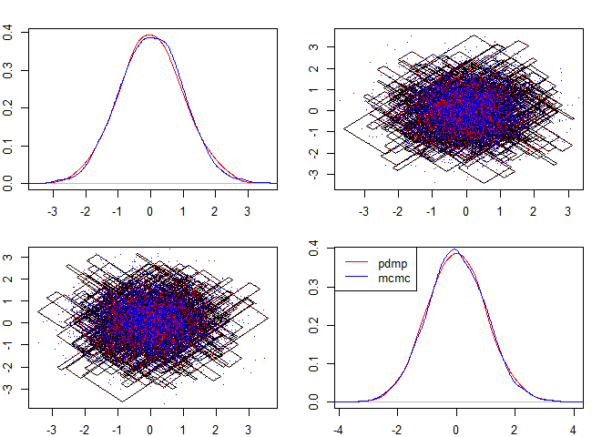

Untitled
================

# Concave-convex PDMP

## Description

This is a trimmed version of the code I have which focuses on simulating
the rate using the CC-PDMP approach and the algorithm for Zig-Zag in R.
The c++ code is in the src directory and consists of classes to simulate
a rate based on a concave-convex decomposition, evaluate and construct a
polynomial and simulate a rate based on a polynomial bound.

The code in R contains the functions for implementing the Zig-Zag.

## Install

First clone the repo locally. Install R and Rstudio. If you click the
ccpdmp.Rproj it should open up Rstudio in a project. On the right you’ll
see all the files and information of the package. Before installing this
package you may need to run the following to get some required packages:

``` r
install.packages("Rcpp")
install.packages("RcppArmadillo")
```

To compile and run this package press control shift B. You should be
able to run the code below.

## A Quick example of the method

We are interested in sampling a density:

*π*(*x*) ∝ exp (−*U*(*x*))

A simple example is the normal distribution with mean zero and variance
1: *U*(*x*) = 0.5*x*<sup>2</sup>. We need a function for the derivative
of this:

*U*′<sub>*i*</sub>(*x*) = *x*<sub>*i*</sub>

The rate for the i-th component of the Zig-Zag is
*λ*<sub>*i*</sub>(*t*) = max (0,*U*′<sub>*i*</sub>(*x*)) = max (0,*x*<sub>*i*</sub>+*v*<sub>*i*</sub>*t*).
This event rate (ignoring the max part) is linear. The code below shows
how this can be simulated using the Zig-Zag process in this package.

``` r
library(ccpdmp)
example_dnlogpi # Example potential calculation
```

    ## function(x, index){
    ##   return(x[index])
    ## }
    ## <bytecode: 0x0000000012808b20>
    ## <environment: namespace:ccpdmp>

``` r
z <- zigzag(1e3, example_dnlogpi, x0 = c(0,0), tau_max = 1, poly_order = 1)
plot_pdmp(z, nsamples = 5e3, mcmc_samples = matrix(rnorm(10e3), ncol = 2), pch = '.')
```

<!-- -->

The example\_dnlogpi is a function taking x, and index as arguments and
returning a vector with elements $\\frac{dU(x+vt)}{dx\_i} = x\_i$ for
all *i* in the index argument. The polynomial order is 1 indicating a
linear function is used to simulate the rate (which is exact here). The
tau\_max parameter indicates the maximum length of time considered ahead
of the process.
