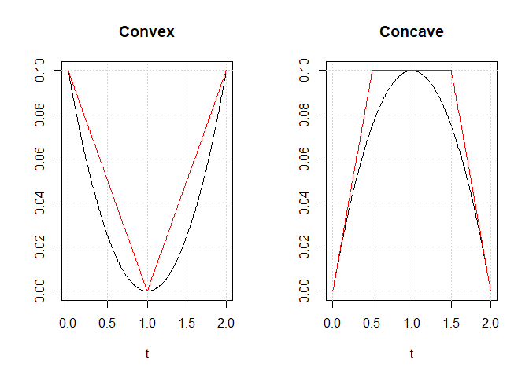
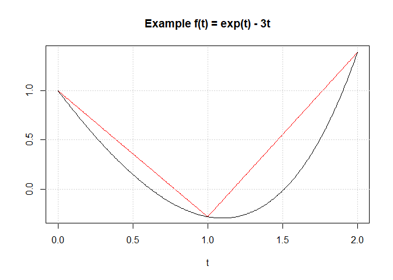
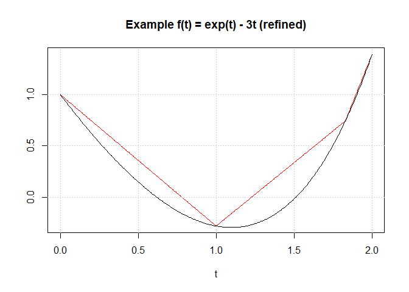
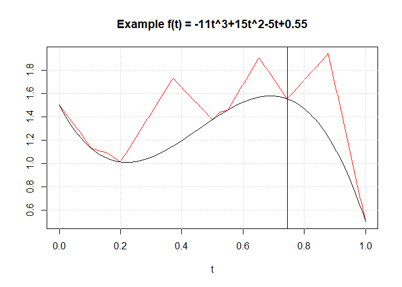

Simulating a Poisson process
================

The key computational difficulty in simulating a PDMP-based sampler is
efficiently simulating from a non-homogeneous Poisson process. Direct
simulation from a poisson process with rate *λ*(*t*) can be achived by
simulating $u$Exp(1) and solving the following for *t*

*u* = ∫<sub>0</sub><sup>*t*</sup>*λ*(*t*)*d**t*

While seemingly simple, this inversion is not trivial. In the PDMP
literature exact simulation has not been used outside of event rates
that are either linear or exponential.

When direct simulation is not possible (or computationally inefficient),
thinning is an approach that can be used to simulate event times.

If simulation is possible for a Poisson process with event-rate *ω*(*t*)
and *ω*(*t*) ≤ *λ*(*t*), then thinning may be used to simulate from a
Poisson process with event rate *λ*(*t*). An event time *τ* is simulated
with event rate *ω*(*t*) and accepted as an event with rate *λ*(*t*)
with probability *λ*(*τ*)/*ω*(*τ*). To implement efficient thinning a
tight upper-bounding rate *ω*(*t*) must be found and must be able to be
simulated.

The ccpdmp package allows simulation from Poisson processes where the
event rate *λ*(*t*) = max (0,*f*(*t*)) has decomposition:

*f*(*t*) = *f*<sub>*u*</sub>(*t*) + *f*<sub>*n*</sub>(*t*)

where *f*<sub>*u*</sub>(*t*) is convex and *f*<sub>*n*</sub>(*t*) is
concave. Piece-wise linear bounds can be found by combining bounds on
the convex and concave parts individually.

<!-- -->

These bounds are constructed based on evaluations of the convex, concave
functions and evaluation of the derivative of the concave function. The
points at which the function are evaluated are called abscissae. For
example *f*(*t*) = exp (*t*) − *t*<sup>2</sup> is decomposed with
*f*<sub>*u*</sub>(*t*) = exp (*t*) and *f*<sub>*n*</sub>(*t*) =  − 3*t*
with *f*<sub>*n*</sub>′(*t*) =  − 3

``` r
f_u <- function(t) exp(t)
f_n <- function(t) -3*t
f_n_dash <- function(t) -3

abscissae <- c(0,1,2)
rates_eval <- rbind( f_u(abscissae), f_n(abscissae), f_n_dash(abscissae))
sim_time = cc_sim(eval_times = abscissae, eval_rates = rates_eval, n_points = 300) # n_points optional for plotting
t_range = sim_time$range
plot(t_range, sim_time$upper_range, type = 'l', xlab = 't',col = 'red', 
     main = 'Example f(t) = exp(t) - 3t',ylab='');grid()
lines(t_range, f_n(t_range) + f_u(t_range))
```

<!-- -->

The simulated event time sim_time$t = 1.8296898 from the upper-bound is
returned along with the value *u* sim_time$u = 0 remaining from the
integration. If the value of *u* \> 0 it means the event was not
simulated from the upper-bounding process on the interval. The function
also returns the value of the upper-bounding function at the simulated
time. So event times may be simulated as follows:

``` r
## Evaluate f at the simulated time t
## It can help to store the f_u, f_n and f_n_dash for future use

f_u_t <- f_u(sim_time$t); f_n_t <- f_n(sim_time$t);f_n_d_t <- f_n_dash(sim_time$t);

f_t <- f_n_t + f_u_t

## Accept sim_time$t as an event with probability:
f_t/sim_time$f_evall
```

    ## [1] 0.6725937

If the event is not accepted the new function evaluation can be added to
construct a more efficient upper-bound (or the process can be updated to
consider the next increment from the rejected point).

``` r
abscissae <- c(abscissae, sim_time$t)
rates_eval <- cbind( rates_eval, c(f_u_t, f_n_t, f_n_d_t))
sim_time = cc_sim(eval_times = abscissae, eval_rates = rates_eval, n_points = 300)
plot(t_range, sim_time$upper_range, type = 'l', xlab = 't',col = 'red', 
     main = 'Example f(t) = exp(t) - 3t (refined)',ylab='');grid()
lines(t_range, f_n(t_range) + f_u(t_range))
```

<!-- -->

### Simulating a polynomial event rate

A polynomial *f*(*t*) will has a concave-convex decomposition formed by
taking the positive terms in the convex function and the negative terms
in the concave function.

Suppose *f*(*t*) =  − 11*t*<sup>3</sup> + 15*t*<sup>2</sup> − 5*t* + 1
the code below can be used to simulate from this polynomial. Unlike the
previous examples *the concave-convex decomposition does not need to be
given*. Instead if the user provides function evaluations and a
polynomial order the package will construct the polynomial using
interpolation and handle the decomposition internally.

``` r
f <- function(t) -11*t^3 + 15*t^2 - 5*t + 1.5
abscissae <- c(0, 0.2, 0.5, 1)
rates_eval <- f(abscissae)
sim_time = sim_rate_poly(eval_times = abscissae, eval_rates = rates_eval, poly_order = 3, n_points = 500)
t_range <- sim_time$range
sim_time$t
```

    ## [1] 0.7440619

``` r
## Time simulated:
plot(t_range, sim_time$upper_range, type = 'l', xlab = 't',col = 'red', 
     main = 'Example f(t) = -11t^3+15t^2-5t+0.55',ylab='');grid()
lines(t_range, f(t_range))
abline(v = sim_time$t)
```

<!-- -->
